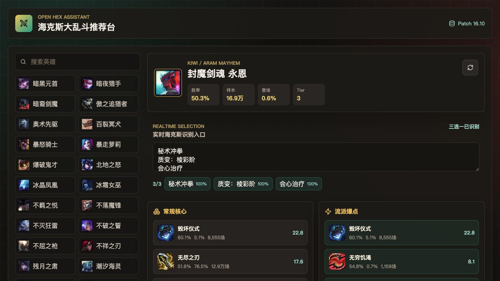
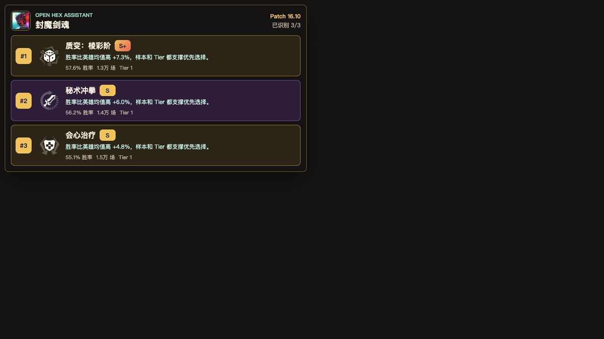
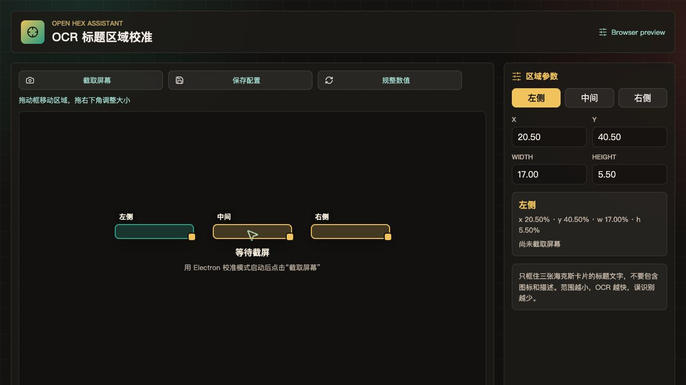

# Open Hex Assistant

语言：中文 | [English](README.en.md)

面向《英雄联盟》海克斯大乱斗的开放源码推荐原型。

本项目是 clean-room 实现，不包含授权码校验、设备绑定、付费分层、遥测锁定或闭源核心依赖。MVP 使用公开统计数据和本地状态，推荐逻辑、OCR、overlay 都在本地运行。

## 当前能力

- 选择英雄并拉取公开海克斯大乱斗统计。
- 按胜率、登场率、样本量、Tier、平均购买顺序推荐装备。
- 推荐英雄专属海克斯。
- 输入 OCR 文本、海克斯中文名或最多 3 个候选海克斯 ID，实时给出三选一排序。
- 为候选海克斯展示 `S+ / S / A / B / C / D` 评级和一句话理由。
- 通过 Electron 运行透明、置顶、可鼠标穿透的游戏内 overlay。
- 通过本地 ONNX PaddleOCR 识别屏幕裁剪区域。

## 预览







## 数据来源

- Riot Data Dragon：英雄和装备元数据。
- `data.v2.iesdev.com`：公开海克斯大乱斗统计。
- `hextech.dtodo.cn`：公开中文海克斯元数据。

这些是第三方/公开数据源，不是腾讯或 Riot 官方产品 API。

## 运行

需要 Node.js 20.19 或更新版本。

```bash
npm install
npm run dev
```

控制台地址：

```text
http://127.0.0.1:5173/
```

浏览器 overlay 预览地址：

```text
http://127.0.0.1:5173/?overlay=1
```

开发服务器已经启动后，运行桌面 overlay：

```bash
npm run overlay:dev
```

Electron overlay 默认透明、无边框、置顶并开启鼠标穿透。手动测试 UI 时可关闭穿透：

```bash
npx cross-env OVERLAY_CLICK_THROUGH=0 npm run overlay:dev
```

可选运行时输入：

```bash
npx cross-env OVERLAY_CHAMPION=777 OVERLAY_CANDIDATES="秘术冲拳|质变：棱彩阶|会心治疗" npm run overlay:dev
```

如果外部 OCR 进程会把最新结果写入本地 JSON 文件，overlay 也可以直接监听该文件：

```bash
cp runtime/overlay-state.example.json runtime/overlay-state.json
npx cross-env OVERLAY_STATE_FILE=runtime/overlay-state.json npm run overlay:dev
```

JSON 格式：

```json
{
  "championId": 777,
  "candidates": ["秘术冲拳", "质变：棱彩阶", "会心治疗"]
}
```

## 本地 ONNX OCR

低延迟链路如下：

```text
屏幕截图 -> 裁剪三个固定标题区域 -> PaddleOCR ONNX 识别 -> overlay 状态
```

这里刻意跳过全屏文字检测。海克斯选择界面的三张卡片位置稳定，校准标题区域后直接裁剪识别，是 500ms 目标内完成识别的关键。

准备模型文件：

```bash
npm run ocr:models
```

脚本会下载中文 PP-OCRv4 识别 ONNX 模型和 PaddleOCR 字典：

```text
models/paddleocr/ch_PP-OCRv4_rec_infer.onnx
models/paddleocr/ppocr_keys_v1.txt
```

ONNX 文件默认被 git 忽略。`npm run ocr:models` 会对下载的 ONNX 和字典做 SHA256 校验；如果你更希望从 PaddleOCR 官方 inference tarball 本地转换，可设置 `PREPARE_PADDLEOCR_CONVERT=1`。

准备配置：

```bash
cp runtime/ocr-config.example.json runtime/ocr-config.json
```

探测一帧：

```bash
npm run ocr:probe
```

运行带实时 OCR 的 overlay：

```bash
npm run dev
npm run overlay:ocr:dev
```

校准三个标题裁剪区域：

```bash
npm run dev
npm run calibrate:dev
```

在校准窗口点击 `截取屏幕`，把三个标题框拖到海克斯标题上，再点击 `保存配置`。配置会写入 `runtime/ocr-config.json`。

常用参数：

```bash
npx cross-env OCR_POLL_MS=80 npm run overlay:ocr:dev
npx cross-env OCR_DEBUG=1 npm run ocr:probe
npx cross-env PADDLEOCR_REC_MODEL=C:/path/rec.onnx PADDLEOCR_DICT=C:/path/ppocr_keys_v1.txt npm run ocr:probe
```

Windows 默认 OCR execution providers：

```json
["dml", "cpu"]
```

DirectML 通过 DirectX 12 为 NVIDIA 和 AMD 显卡加速 ONNX Runtime。仅在需要时覆盖：

```bash
npx cross-env OCR_EXECUTION_PROVIDERS=cpu npm run overlay:ocr:dev
npx cross-env OCR_EXECUTION_PROVIDERS=dml,cpu npm run overlay:ocr:dev
```

想接近 500ms 目标，请保持游戏为无边框/窗口模式，把 `runtime/ocr-config.json` 只校准到三个标题文字条，并提前启动 worker，让 ONNX session 保持预热。

## 无授权设计

项目没有授权码校验路径。未来桌面构建也应把用户身份排除在核心推荐链路之外：

- 数据缓存：本地 JSON 或 IndexedDB
- OCR 结果：本地进程内存
- 设置：本地文件
- 更新：GitHub Releases 或用户自主下载

## 许可证

本项目使用 [MIT License](LICENSE)。

## 后续计划

- 为关键流派补充装备 + 海克斯条件规则，例如 Destroying Ritual、Critical Healing 等。
- 通过 GitHub Actions 打包 Windows 构建。
