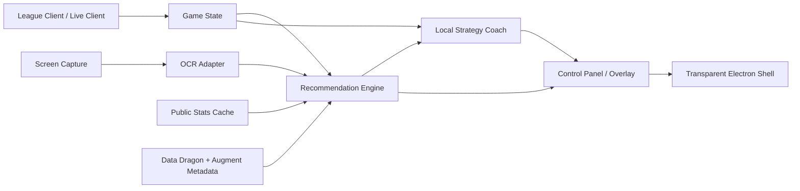
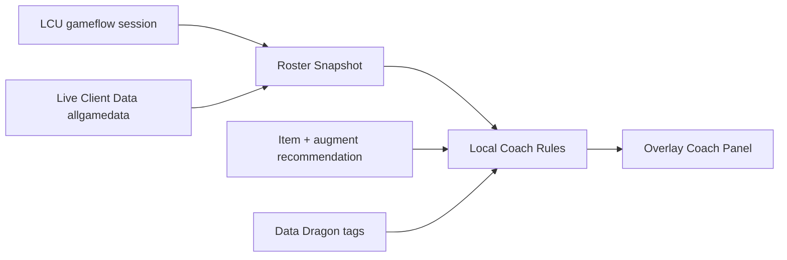

# Architecture

## Goal

Build an open-source ARAM Mayhem assistant without copying proprietary code or using license/device binding.

## Roadmap Alignment

Development should follow the root [ROADMAP.md](../ROADMAP.md). Architecture changes must preserve the local-first, explainable, no-auth-lock-in direction unless the roadmap is updated first.

## Modules



## Recommendation Inputs

- `championId`
- `currentItems`
- `selectedAugments`
- `candidateAugments`
- `teamRosters`
- `enemyRoster`
- `patch`

The current renderer supports `championId`, `candidateAugments`, and local Coach inputs from the Electron worker. Desktop integration fills current items and roster state through LCU / Live Client Data.

## Realtime OCR Boundary

The web MVP already has the text-to-augment matching step:

```text
OCR text / augment names / augment IDs -> candidate augment IDs -> recommendation engine
```

Desktop integration should add this adapter:

```ts
type CandidateAugmentDetection = {
  id: number
  name: string
  confidence: number
}

async function detectCandidateAugments(frame: ImageData): Promise<CandidateAugmentDetection[]>
```

Recommended first desktop implementation:

- capture the game window or a user-defined region
- crop the three augment cards
- run local OCR on each card title
- pass recognized text into the existing matcher
- keep the full pipeline local; no screenshot upload

The implemented worker uses this gated faster path:

```mermaid
flowchart LR
  LCU["LCU HTTP + WebSocket + Live API"] --> Game["Gameflow + champion gate"]
  Game --> Capture["screenshot-desktop"]
  Capture --> Trigger["Augment-pick screen trigger"]
  Trigger --> Crop["Sharp ROI crops"]
  Crop --> Rec["PaddleOCR rec ONNX"]
  Rec --> Json["overlay state JSON / stdout"]
  Json --> Electron["Electron main process"]
  Electron --> Overlay["React overlay"]
```



It uses fixed title ROIs instead of a detector model. That is the correct default for a 500 ms requirement because the three card locations are predictable during augment selection. The worker does not run PaddleOCR continuously by default: it connects to LCU over HTTP/WebSocket, waits for an in-game gameflow phase, resolves the local champion, then runs a cheap image-statistics trigger over the calibrated title strips, and only runs OCR while the augment picker is active. If LCU is briefly unavailable while the game is already running, the worker can use the Live Client Data API on port `2999` as a game/champion fallback.

## Local Strategy Coach

The Coach feature is intentionally local-first. It does not call Gemini, OpenAI, or any remote inference service by default.



During loading or game start, the worker reads `gameData.teamOne` and `gameData.teamTwo` from `/lol-gameflow/v1/session`. During the match, it prefers `https://127.0.0.1:2999/liveclientdata/allgamedata`, which gives structured players, levels, and item ids. The renderer then classifies compositions from Data Dragon champion tags and combines that with the current recommendation result to show:

- composition matchup
- teamfight plan
- top enemy threats with deterministic reasons
- next-item and situational item notes
- candidate augment summary

`F9` sends `coach-now` to the worker and forces an immediate snapshot. Passive Coach refreshes are throttled by `COACH_PASSIVE_POLL_MS`.

## ROI Calibration

Calibration runs as a separate Electron mode:

```bash
npm run calibrate:dev
```

The calibration renderer uses a small preload API:

- `captureCalibrationScreen()`: returns a screen PNG and current OCR config
- `loadOcrConfig()`: reads the effective OCR config
- `saveOcrConfig(config)`: validates and writes `runtime/ocr-config.json`

The React calibration page only edits ratio-based `titleRoi` rectangles. OCR execution, screen capture, filesystem writes, and config normalization stay in Electron/Node modules.

## Overlay Runtime

The current desktop shell is `electron/main.cjs`. It loads the same React app with `?overlay=1` and creates a transparent, frameless, always-on-top window.

Runtime controls:

- `LCU_ENABLED=0`: disable LCU integration and use the process/screen fallback gate
- `LCU_REQUIRE_GAMEFLOW=0`: allow fallback gates to continue when LCU is disconnected
- `LCU_LOCKFILE`: explicit path to the League Client lockfile
- `LCU_INSTALL_DIR`: explicit League install directory containing `lockfile`
- `LCU_ALLOWED_PHASES`: comma-separated in-game phases, defaults to `InProgress,Reconnect`
- `OVERLAY_CHAMPION`: champion id, for example `777`
- `OVERLAY_CANDIDATES`: three candidate augment names or ids separated by `|`, comma, semicolon, or newline
- `OVERLAY_STATE_FILE`: JSON file watched every 500 ms for live OCR results
- `OCR_ENABLED=1`: start the built-in OCR worker from Electron in development; packaged builds start it by default unless `OCR_ENABLED=0`
- `OCR_CONFIG`: path to `runtime/ocr-config.json`
- `OCR_NODE`: optional external Node executable for the OCR worker; by default Electron runs the worker through its own Node runtime
- `OCR_AUTO_GATE=0`: disable automatic LoL/augment gating and run continuous OCR
- `OCR_REQUIRE_LEAGUE_PROCESS=0`: disable only the LoL process gate
- `OCR_FORCE_ACTIVE=1`: force the worker into the OCR phase for debugging
- `OCR_IDLE_POLL_MS`: process check interval while LoL is absent
- `OCR_GAME_POLL_MS`: lightweight trigger interval while LoL is running
- `OCR_POLL_MS`: capture interval in milliseconds
- `OCR_CROP_SCALE`: title crop upsample factor before OCR, defaults to `2`
- `OCR_CROP_GRAYSCALE=0`: disable grayscale conversion before OCR
- `OCR_CROP_SHARPEN=1`: enable crop sharpening before OCR
- `COACH_ENABLED=0`: disable only the local strategy Coach
- `COACH_PASSIVE_POLL_MS`: minimum passive Coach refresh interval
- `OCR_DEBUG=1`: write the cropped card title images to `runtime/ocr-debug`
- `OVERLAY_CLICK_THROUGH=0`: disable mouse passthrough for testing

Default behavior is mouse passthrough so the overlay does not block in-game clicks. `F6` forces one recognition pass, `F7` refreshes champion detection, `F8` clears the current OCR candidates, `F9` refreshes Coach strategy state, `CommandOrControl+Shift+O` toggles passthrough, and `CommandOrControl+Shift+R` reloads the overlay.

The watched JSON file should use this shape:

```json
{
  "championId": 777,
  "candidates": ["秘术冲拳", "质变：棱彩阶", "会心治疗"]
}
```

The OCR process can be implemented independently. Its only contract with the recommendation UI is to keep this file updated when the detected champion or the three augment cards change.

## 500 ms Budget

The expected latency budget on a warmed process:

- screen capture: 80-180 ms
- three ROI crops: 10-30 ms
- three recognition passes: 60-220 ms on CPU, lower with a small model and good threading
- JSON bridge and React update: under 20 ms

The first inference after launch is slower because ONNX Runtime initializes and optimizes the graph. Start the worker before queueing so the model is warm by the time the augment selection appears.

## Windows GPU Path

The Windows runtime uses ONNX Runtime Node prebuilt binaries. The practical default is DirectML:

```json
["dml", "cpu"]
```

DirectML works with DirectX 12 capable NVIDIA and AMD GPUs and falls back to CPU if the GPU provider is unavailable. CUDA is not the default for this Electron/Node path because the current Windows prebuilt `onnxruntime-node` package supports DML/WebGPU on Windows, while CUDA support is aimed at Linux x64 in the prebuilt Node package.

## Windows Packaging

Windows artifacts are built with Electron Builder on `windows-latest` through `.github/workflows/windows-build.yml`. The workflow only runs for pushed version tags matching `v*`; regular `main` pushes do not package the app.

The tag must match `package.json` exactly with a leading `v`, for example `v0.1.0` for package version `0.1.0`. After packaging, the workflow creates or updates the matching GitHub Release and uploads the portable zip target:

```text
release/Open Hex Assistant-0.1.0-win-x64.zip
```

The package includes:

- Electron runtime
- production Node dependencies and native Windows binaries
- `dist/` renderer assets
- Electron main/worker code
- PaddleOCR ONNX model and dictionary as extra resources
- OCR example config as an extra resource

Runtime config and OCR state should be written under Electron's user-data directory in packaged builds. Model and dictionary paths resolve from `process.resourcesPath`, while development builds continue to resolve relative to the project root.

## Recommendation Outputs

- candidate augment ordering
- candidate augment grade
- one-line candidate augment reason
- regular core items
- high-win archetype items
- local Coach composition and item notes
- local Coach threat list and scoreboard-derived item signals
- data source and patch

## Auth Removed

No license server, no device ID binding, and no paid tier branching. If updates are needed, use GitHub Releases and keep update checks optional.

## Clean-Room Boundary

Allowed:

- public web page behavior analysis
- public API response shape analysis
- independent implementation of the same user-facing idea

Not allowed:

- copying proprietary source
- bypassing licensing
- extracting private keys or service tokens
- cloning private backend behavior
